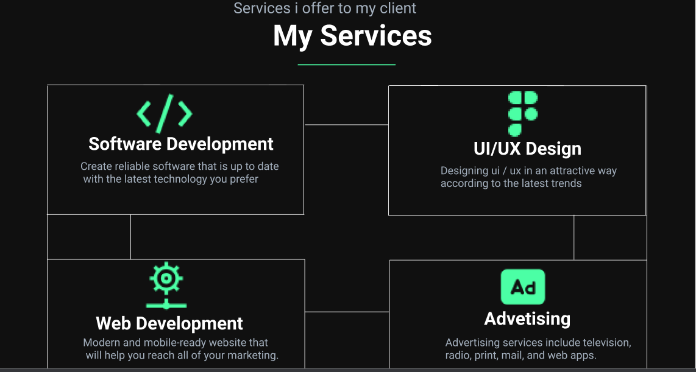

<h1 align="center">**This is my profile**</h1>

### 🅿🆁🅾🅵🅸🅻🅴 view 🕵️‍♂️
- My primary coding language : Java 🧒
- Graduate in Software Engineering at IJSE 👨‍🎓
- Proud to be Sri lankan. 💙
- Programming Skills : *Java, HTML, CSS, JavaScript, NodeJS
- Design Skills : *AdobeXD, Figma

<h2>Overview My Profile🕵️‍♂️ </h2>

<h3 align="center">Home Section🧒</h3>

<h3 align="center">About Me</h3>

<h3 align="center">My Skill</h3>

<h3 align="center">My Service</h3>

<h3 align="center">My experience</h3>

<h3 align="center">Education</h3>

<h3 align="center">Projects</h3>

<h3 align="center">Contacts</h3>

## :link: **Links**
- Website : [Lakmal Sulochana]()
- GitHub-Pages : [LakmalSulochana.github.io](https://github.com/LakmalSulochana)
- Site Map : [Click Here](https://www.gloomaps.com/AtsQqWJjXd)
- Wireframe : [Click Here](https://wireframe.cc/huRbFR)
- Mockup : [Click Here](https://www.figma.com/file/axhp8GC5KQrahHbho0qKHx/Untitled?node-id=80%3A637)

<a href="https://github.com/LakmalSulochana/MyProfile/blob/master/README.md">
Lakmal Sulochana Readme Profile Styles here ! ✌
</a>

  

